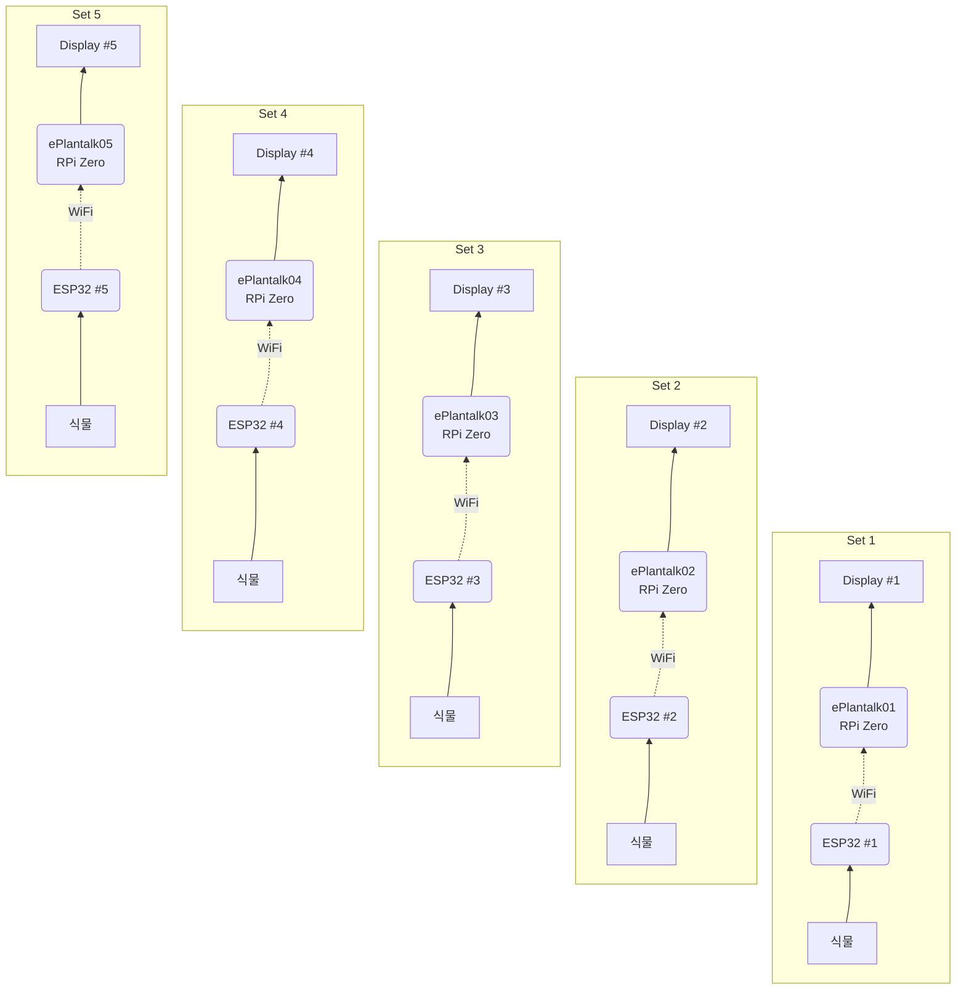

# 🌱 e-Plantalk 프로젝트 실행 계획서

이 문서는 라즈베리 파이와 E-ink 디스플레이, 그리고 ESP32 무선 센서 노드를 활용한 반려 식물 대화 프로젝트의 진행 절차를 기술합니다.

## 1. 프로젝트 개요
*   **목표:** 식물의 토양 습도와 조도를 측정하여, 식물의 상태를 E-ink 디스플레이에 "대화체 말풍선"으로 시각화.
*   **핵심 컨셉:** 물리적으로 분리된 센서와 디스플레이를 WiFi로 연결하여 거리 제약(5m) 해결 및 설치 편의성 확보.
*   **규모:** 총 5세트의 독립적인 기기를 연속으로 설치하여 5개의 화분 관리.

## 2. 시스템 아키텍처

**[하이브리드 네트워크 구조]**
외부 공유기 없이 1:1 연결을 기본으로 하되, 개발 편의를 위해 이중 접속 전략을 사용합니다.

1.  **Server (ESP32):** 항상 독자적인 WiFi 망(`ePlantalk-AP-xx`)을 생성하는 **AP 모드**로 동작 (IP: 192.168.4.1 고정).
2.  **Client (RPi Zero):** 부팅 시 설정된 우선순위에 따라 WiFi 연결을 시도.
    *   **Priority 1 (개발용):** 집/사무실 WiFi. 연결 시 SSH 접속 및 업데이트 가능.
    *   **Priority 2 (운영용):** ESP32 AP. 연결 시 센서 데이터 수신 및 디스플레이 가동.

*   **시간 동기화:** 운영 모드에서는 인터넷이 없으므로, 시간 대신 **조도 센서 데이터**를 기반으로 주/야간을 판단합니다.

**[5세트 확장 구조]**
각 세트는 독립적으로 동작하며, 1:1로 매칭됩니다.
*   **Set 1:** Plant Sensor 01 (AP) <--> Display Hub 01 (Station)

*   **Set 2:** Plant Sensor 02 <--> Display Hub 02
...
*   **Set 5:** Plant Sensor 05 <--> Display Hub 05



## 3. 하드웨어 준비물 (BOM) - 1세트 기준 (총 5세트 필요)

### A. 식물 위성 (Sensor Node)
*   **MCU:** ESP32 DevKit V1 (또는 호환 보드)
*   **습도 센서:** 정전식(Capacitive) 토양 수분 센서 v1.2 (부식 방지 필수)
*   **조도 센서:** BH1750 (I2C) 또는 CDS 광센서 + 10kΩ 저항
*   **전원:** 마이크로 USB 케이블 + USB 충전기

### B. 메인 스테이션 (Display Hub)
*   **컴퓨터:** Raspberry Pi Zero 2 W
*   **디스플레이:** Waveshare 10.85inch E-Paper HAT (SPI 연결)
*   **전원:** 5V 2.5A 이상 전원 어댑터

---

## 4. 단계별 진행 가이드 (Step-by-Step)

### Phase 1: 식물 위성 만들기 (Sensor Node Setup)
**목표:** 센서 값을 읽어 WiFi를 통해 JSON 형태로 제공하는 웹 서버 구축. (5개 기기 식별 전략 포함)
1.  **ESPHome 설치:** PC에 ESPHome 설치 또는 Home Assistant의 ESPHome 애드온 활용.
2.  **펌웨어 작성 (`plant_sensor.yaml`):**
    *   **호스트네임 구분:** `plant-sensor-01`, `plant-sensor-02` 등으로 파일 분리 또는 치환 변수 사용.
    *   WiFi 연결 설정 (SSID, Password).
    *   ADC 센서(토양) 및 I2C 센서(조도) 읽기 설정.
    *   데이터 보정(Calibration): 각 센서별(5개 모두) 개별 보정 필요 (센서마다 편차가 있음).
3.  **플래싱:** 5개의 ESP32에 각각 맞는 펌웨어 업로드.
4.  **테스트:** 브라우저에서 `http://plant-sensor-01.local/sensor/moisture` 등으로 각각 접속 확인.

### Phase 2: 메인 스테이션 기본 설정 (RPi Setup)
**목표:** 라즈베리 파이에서 Python으로 E-ink 디스플레이 제어 확인.
1.  **OS 설치:** Raspberry Pi OS Lite (64-bit 권장) 설치.
    *   호스트네임 설정: `ePlantalk01` ~ `05`.
2.  **SPI 활성화:** `sudo raspi-config` -> Interface Options -> SPI -> Enable.
3.  **라이브러리 설치:**
    *   `BCM2835`, `WiringPi` (필요 시), `waveshare-epd` 라이브러리 설치.
    *   Python 의존성: `Rpi.GPIO`, `spidev`, `Pillow`.
4.  **화면 테스트:** Waveshare 제공 예제 코드를 실행하여 화면 출력 확인.

### Phase 3: 데이터 수집 및 로직 구현 (Backend)
**목표:** 식물 위성에서 데이터를 가져와 "식물의 기분"을 결정하는 로직 작성. (설정 파일 기반)
1.  **Configuration:** `config.json` 파일 생성.
    ```json
    {
      "sensor_host": "plant-sensor-01.local",
      "plant_name": "몬스테라",
      "personality": "gentle"
    }
    ```
2.  **Data Fetcher:** Config에 지정된 호스트(`sensor_host`)로 API 요청.
3.  **Logic Core:**
    *   데이터 분석: 습도 0~100%, 조도 Lux 값 파싱.
    *   상태 결정 알고리즘: (예: 습도 < 30% AND 조도 > 1000 → "목마른데 눈부셔")
    *   대사 선택: 미리 정의된 `dialogue_db.json`에서 적절한 문구 랜덤 선택.

### Phase 4: UI 렌더링 (Frontend)
**목표:** 텍스트와 아이콘을 합성하여 E-ink용 비트맵 이미지 생성.
1.  **Canvas 설정:** 디스플레이 해상도(1360x960)에 맞는 흑백(1-bit) 캔버스 생성.
2.  **Drawing:**
    *   배경 그리기.
    *   말풍선 SVG 또는 이미지 배치.
    *   선택된 대사 텍스트 합성 (한글 폰트 적용 필수).
3.  **Output:** `epd.display(buffer)` 함수로 화면 전송.

### Phase 5: 통합 및 자동화 (Integration)
**목표:** 전원만 꽂으면 알아서 동작하도록 설정.
1.  **Main Loop:** 위 기능들을 하나로 묶는 `main.py` 완성.
2.  **예외 처리:** WiFi 끊김, 센서 오류 시 프로그램이 죽지 않고 재시도하도록 처리.
3.  **서비스 등록:** `systemd`를 사용하여 부팅 시 자동 실행 설정.
    *   `/etc/systemd/system/plantalk.service` 작성.
4.  **케이스 제작:** 하드웨어 보호를 위한 케이스 조립 및 배치.

---

## 5. 개발 로드맵 체크리스트

현재 하드웨어 상황(RPi/E-ink 보유, ESP32 미보유)을 반영하여 재구성된 로드맵입니다.

### Step 1: E-ink 디스플레이 하드웨어 검증 (Priority)
*목표: 라즈베리 파이 세팅 및 디스플레이 출력 테스트를 가장 먼저 수행합니다.*
- [x] **기본 시스템 환경 구성**
    - [x] Raspberry Pi OS Lite 설치 및 SSH 접속 설정
    - [x] `raspi-config` 설정: SPI 인터페이스 활성화 (Display 통신 필수)
    - [x] 필수 시스템 패키지 설치 (`git`, `python3-pip`, `libopenjp2-7`, `libtiff5` 등)
- [x] **E-ink 드라이버 및 라이브러리 설치**
    - [x] Python 필수 라이브러리 설치 (`spidev`, `RPi.GPIO`, `Pillow`)
    - [x] Waveshare e-Paper git 저장소 클론 및 드라이버 설치
- [x] **Hello World (화면 출력 테스트)**
    - [x] 제조사 제공 데모 코드(`main.py`) 실행 및 화면 갱신 확인
    - [x] **Custom 테스트:** Python `Pillow`를 이용해 흰 배경에 검은 텍스트("Hello Plant") 그리기
    - [x] Partial Update(부분 갱신) vs Full Update(전체 갱신) 동작 차이 확인

### Step 2: 식물 위성 만들기 (Real Sensor Node Setup)
*목표: ESP32-C3 미니 보드를 사용하여 독자적인 WiFi 망(AP)을 생성하고 센서 데이터를 제공합니다.*
- [x] **ESPHome 설치 및 환경 구성**
    - [x] PC 또는 서버에 ESPHome 설치
    - [x] ESP32-C3 미니 보드 드라이버 확인 (CH34x 등)
- [x] **펌웨어 작성 (`plant_sensor.yaml`)**
    - [x] **보드 설정:** `board: esp32-c3-devkitm-1`
    - [x] **WiFi 설정 (AP Mode):**
        - [x] `ap:` 모드 활성화
        - [x] SSID: `ePlantalk-AP-01` (세트별 번호 부여)
        - [x] Password 설정 및 고정 IP (`192.168.4.1`)
    - [x] **센서 정의:** ADC(토양) 및 I2C(조도)
    - [x] **Web Server 활성화:** API 엔드포인트 노출
- [ ] **플래싱 및 하드웨어 테스트**
    - [ ] USB 연결 후 펌웨어 업로드
    - [ ] PC/폰으로 `ePlantalk-AP-01` 와이파이 접속 테스트
    - [ ] `http://192.168.4.1/sensor/...` 데이터 확인

### Step 3: 로직 및 UI 데이터 바인딩
*목표: 센서 데이터를 기반으로 식물의 상태를 판단하고 화면을 그립니다.*
- [ ] **네트워크 설정 (RPi)**
    - [ ] `wpa_supplicant.conf` 구성: 개발용 WiFi(우선순위 높음) + ESP32 AP(우선순위 낮음) 등록
- [x] **초기 프로토타입 (Grid & Static Info)**
    - [x] `main.py` 작성: 50px 그리드 출력 후 3초 대기 -> "moisture: 0, light: 0" 표시 (7초 간격 업데이트)
    - [x] Systemd 서비스 파일 작성 (`eplantalk.service`)
    - [x] WiFi SSID 화면 표시 (우상단, Font 10)
- [ ] **설정(Config) 및 로직 구현**
    - [ ] `config.json` 작성 (타겟 IP: `192.168.4.1`)
    - [ ] **상태 머신:** 조도 센서 값으로 낮/밤 판단 로직 추가 (NTP 대체)
    - [ ] `dialogues.json`: 상태별 대사 DB 구축
- [ ] **UI 렌더링 엔진 개발**

    - [ ] **Canvas:** E-ink 해상도 맞춤 1-bit 캔버스 생성
    - [ ] **타이포그래피:** 한글 폰트 로드 및 줄바꿈 처리
    - [ ] **이미지 합성:** 말풍선 + 텍스트 + 아이콘 합성 로직

### Step 4: 통합 및 자동화
*목표: 전원 인가 시 프로그램이 자동으로 동작하도록 만듭니다.*
- [ ] **메인 루프(Main Loop) 완성:** [데이터 수신] -> [판단] -> [렌더링] -> [갱신] -> [Sleep]
- [ ] **예외 처리:** 네트워크 오류 및 센서 연결 실패 시 재시도(Retry) 로직
- [ ] **자동 실행:** `systemd` 서비스 등록 (`plantalk.service`)

